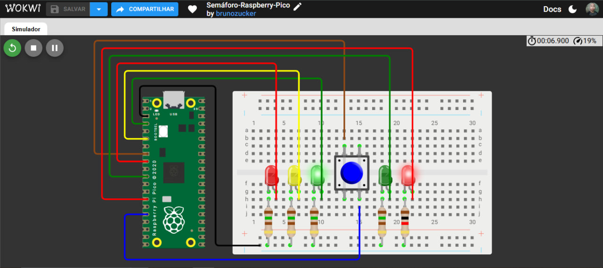

# 🚦 Semáforo-Raspberry-Pico

Simulação de um cruzamento com semáforo de carros, semáforo de pedestres e botão de travessia, feita com Raspberry Pi Pico no Wokwi.

---

## 📋 Sobre o projeto

A ideia foi reproduzir o funcionamento de uma faixa de pedestres com botão: os carros seguem com o sinal verde até alguém pedir para atravessar, e aí o semáforo faz toda a transição até liberar o pedestre.

Esse projeto é a versão para Raspberry Pi Pico do meu semáforo feito originalmente em Arduino Uno. A lógica é a mesma, o que muda é a placa e a numeração dos pinos, que aqui são chamados de GPIO.

O projeto foi feito como parte do meu portfólio prático de sistemas embarcados, usando o Wokwi como ambiente de simulação.

▶️ [Abrir a simulação no Wokwi](https://wokwi.com/projects/476146429517246465)

---

## 🛠 Ferramentas utilizadas

- Wokwi (simulador)
- Raspberry Pi Pico
- Protoboard
- 3 LEDs para o semáforo dos carros (verde, amarelo e vermelho)
- 2 LEDs para o semáforo dos pedestres (verde e vermelho)
- 1 botão (pushbutton)
- 4 resistores de 150 Ω e 1 resistor de 1 kΩ (um por LED, veja a nota no final)
- Linguagem C++ (API do Arduino)

---

## 🏗 O que foi montado

O circuito tem dois semáforos e um botão. O semáforo dos carros usa três LEDs e o dos pedestres usa dois. Cada LED tem um resistor em série ligado ao trilho de GND da protoboard.

O botão fica ligado entre o GPIO 12 e o GND. Como o código usa o resistor de pull-up interno do Pico, não foi preciso colocar nenhum resistor externo nele.

### Pinagem

| Componente | Pino do Raspberry Pi Pico |
|---|---|
| LED verde (carros) | GP2 |
| LED amarelo (carros) | GP4 |
| LED vermelho (carros) | GP6 |
| LED verde (pedestres) | GP8 |
| LED vermelho (pedestres) | GP10 |
| Botão de travessia | GP12 |

---

## 🔧 Como funciona

### Estado inicial

Sem ninguém apertar o botão, o semáforo dos carros fica **verde** e o dos pedestres fica **vermelho**.

### Quando o botão é pressionado

1. O código faz um debounce simples: espera 50 ms e confirma se o botão continua pressionado, pra evitar leitura falsa por ruído.
2. O verde dos carros continua aceso por 5 segundos e depois apaga.
3. O vermelho dos carros pisca 3 vezes.
4. O amarelo dos carros pisca 4 vezes.
5. O vermelho dos carros fica aceso e o pedestre recebe o verde.
6. O pedestre tem 5 segundos para atravessar.
7. Os LEDs apagam e o ciclo volta ao estado inicial.

No total, uma travessia completa leva cerca de 17 segundos.

---

## 💻 Código

```cpp
// Semáforo-Raspberry-Pico

// Define os pinos dos LEDs do semáforo dos carros
#define LED_S_VERDE_GPIO 2
#define LED_S_AMARELO_GPIO 4
#define LED_S_VERMELHO_GPIO 6

// Define os pinos dos LEDs do semáforo dos pedestres
#define LED_P_VERDE_GPIO 8
#define LED_P_VERMELHO_GPIO 10

// Define o pino do botão para solicitar a travessia
#define BOTAO_GPIO 12

void setup() {
  // LEDs do semáforo como "saída"
  pinMode(LED_S_VERDE_GPIO, OUTPUT);
  pinMode(LED_S_AMARELO_GPIO, OUTPUT);
  pinMode(LED_S_VERMELHO_GPIO, OUTPUT);

  // LEDs do pedestre como "saída"
  pinMode(LED_P_VERDE_GPIO, OUTPUT);
  pinMode(LED_P_VERMELHO_GPIO, OUTPUT);

  // Configura o botão como entrada utilizando o resistor de pull-up interno
  pinMode(BOTAO_GPIO, INPUT_PULLUP);
}

void loop() {
  // Estado inicial, ambos ligados
  digitalWrite(LED_S_VERDE_GPIO, HIGH);
  digitalWrite(LED_P_VERMELHO_GPIO, HIGH);

  // Espera o botão ser pressionado
  if (digitalRead(BOTAO_GPIO) == LOW) 
  {
    // Debounce simples
    delay(50);
    
    // Confirma se o botão continua pressionado
    if (digitalRead(BOTAO_GPIO) == LOW)
    {
      // Mantém o verde do semáforo durante 5 segundos
      delay(5000);

      // Apaga o verde do semáforo
      digitalWrite(LED_S_VERDE_GPIO, LOW);

      // Vermelho do semáforo piscando três vezes
      for (int i = 0; i < 3; i++)
      {
        // Ligado
        digitalWrite(LED_S_VERMELHO_GPIO, HIGH);
        delay(500);

        // Desligado
        digitalWrite(LED_S_VERMELHO_GPIO, LOW);
        delay(500);
      }

      // Amarelo do semáforo piscando quatro vezes
      for (int i = 0; i < 4; i++)
      {
        // Ligado
        digitalWrite(LED_S_AMARELO_GPIO, HIGH);
        delay(500);

        // Desligado
        digitalWrite(LED_S_AMARELO_GPIO, LOW);
        delay(500);
      }

      // Semáforo vermelho ligado
      digitalWrite(LED_S_VERMELHO_GPIO, HIGH);

      // Pedestre verde ligado
      digitalWrite(LED_P_VERDE_GPIO, HIGH);

      // Pedestre vermelho desligado
      digitalWrite(LED_P_VERMELHO_GPIO, LOW);

      // Tempo para o pedestre atravessar
      delay(5000);

      // LED verde do pedestre desligado
      digitalWrite(LED_P_VERDE_GPIO, LOW);

      // LED vermelho do semáforo desligado
      digitalWrite(LED_S_VERMELHO_GPIO, LOW);
    }
  }
}
```

---

## 📸 Evidências do funcionamento

### Circuito montado no Wokwi
A visão geral mostra o Raspberry Pi Pico, a protoboard com os cinco LEDs, os resistores e o botão azul de travessia.



---

## 📁 Arquivo do diagrama

O arquivo `diagram.json` com todas as peças e conexões está disponível no repositório e pode ser importado direto no Wokwi.

[📥 Download — diagram.json](diagram.json)

---

## 💡 O que aprendi com esse projeto

O principal foi ver como um projeto pode ser portado de uma placa para outra. O código do Uno foi aproveitado quase inteiro, e o que mudou foi a referência dos pinos, que no Pico são GPIOs (GP2, GP4, GP6 e assim por diante).

O `INPUT_PULLUP` continua funcionando do mesmo jeito: o botão é ligado entre o GPIO e o GND, e `LOW` significa botão pressionado. O debounce de 50 ms também segue necessário pra evitar leitura falsa.

Outra diferença importante é que o Pico trabalha com 3,3 V nos pinos, enquanto o Uno usa 5 V. Isso muda a corrente que passa pelos LEDs e deve ser levado em conta na escolha dos resistores.

---

## ⚠️ Sobre o projeto

Essa simulação é uma versão simples de um semáforo de pedestres. Ela não tem sensor de carros, temporização variável nem ciclo automático. O objetivo foi praticar o controle de saídas digitais, leitura de botão e sequência de estados numa placa diferente.

Sobre os resistores: quatro LEDs usam 150 Ω e o LED vermelho dos pedestres usa 1 kΩ, por isso ele brilha menos que os outros. Se quiser todos com o mesmo brilho, basta usar 150 Ω nele também. Numa montagem física, valores entre 150 Ω e 330 Ω funcionam bem com os 3,3 V do Pico.

---

## 🚀 Próximos projetos

Outros projetos de sistemas embarcados serão postados em breve, com níveis de complexidade maiores.

---

## 👤 Autor: Bruno Zucker
